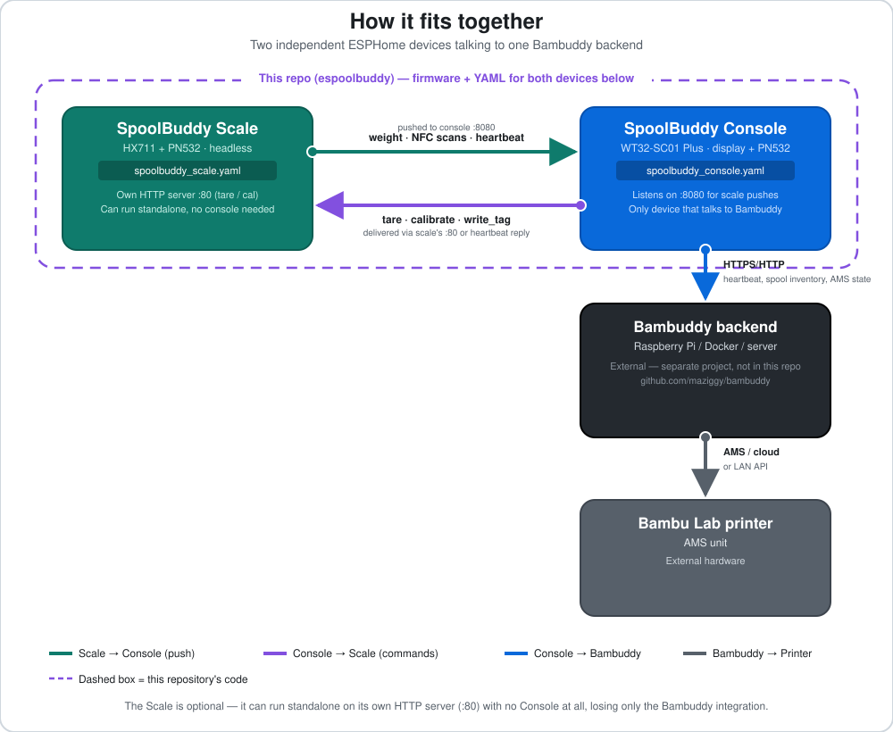
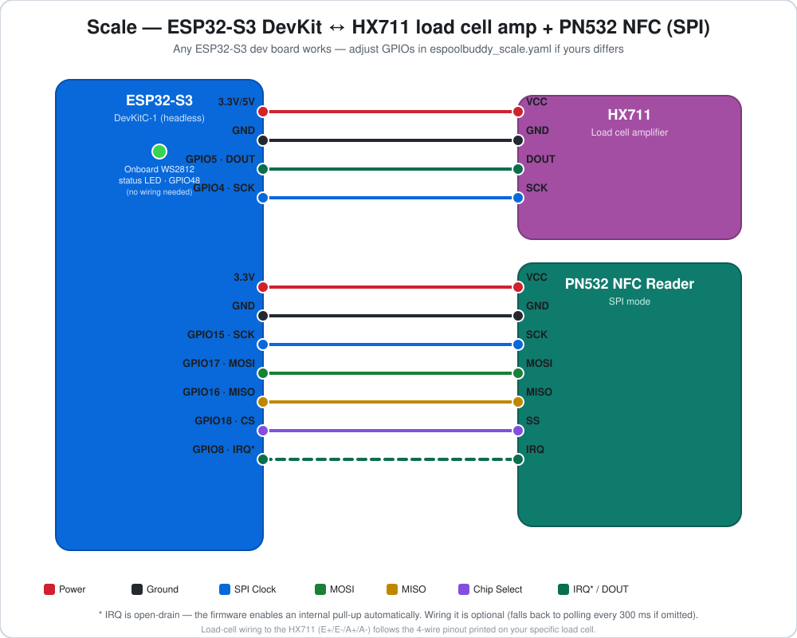

# ESPoolBuddy

[](https://github.com/CSchlipp/espoolbuddy/actions/workflows/esphome-compile.yml)
[](https://github.com/CSchlipp/espoolbuddy/stargazers)
[](https://www.buymeacoffee.com/cschlipp)
[](https://ko-fi.com/cschlipp)

**ESPoolBuddy** is a native [ESPHome](https://esphome.io) firmware that turns a
pair of cheap ESP32-S3 boards into a NFC-tagged filament spool tracker for
[Bambuddy](https://github.com/maziggy/bambuddy) — no Raspberry Pi, SD card, or
Linux image required. It replicates the majority of the
[SpoolBuddy](https://github.com/maziggy/bambuddy/tree/main/spoolbuddy) feature
set (the official Raspberry-Pi-based SpoolBuddy client) as ESP32 firmware,
talking to the unmodified Bambuddy backend API.

A full setup is **two devices**:

- **Console** — touchscreen display, shows AMS/filament status, lets you scan,
  assign and browse spools, and (optionally) shows live scale weight.
- **Scale** — a load cell + NFC reader that weighs a spool and pushes the
  reading straight to the console. 

You only need the Console to get started; the Scale is an optional add-on.

---

## Credits & related projects

This project stands on the shoulders of two other open-source projects:

- **[Bambuddy](https://github.com/maziggy/bambuddy)** by [maziggy](https://github.com/maziggy) —
  the backend server this firmware talks to. It manages your spool inventory,
  Bambu Lab printer/AMS polling, and the original Raspberry-Pi SpoolBuddy
  client that this firmware reimplements. **You need a running Bambuddy
  instance before an ESPoolBuddy device is useful** — see its repo for setup.
- **[SpoolEase](https://github.com/yanshay/SpoolEase)** by [yanshay](https://github.com/yanshay)
  ([spoolease.io](https://www.spoolease.io/)) — the hardware design this
  project's console is built around. The WT32-SC01 Plus + PN532 wiring
  approach, and the general console/scale two-device concept, are based on
  SpoolEase's excellent [hardware build guide](https://docs.spoolease.io/docs/build-setup/console-build)
  and case/mount designs on [MakerWorld](https://makerworld.com/en/models/1138678-spoolease-console-nfc-rfid-filament-management).
  ESPoolBuddy reuses that hardware but is a from-scratch ESPHome firmware
  speaking the Bambuddy API — it is not SpoolEase's firmware and is not
  affiliated with or supported by the SpoolEase project.

If you're already running Bambuddy, maybe have the SpoolEase hardware at hand already, and want a
dedicated NFC console/scale for it, you're in the right place.

---

## How it fits together



This single repository builds and configures **both** devices — the
`spoolbuddy_scale.yaml` and `spoolbuddy_console.yaml` entry points shown
above, sharing the same `components/` code. Bambuddy and the Bambu Lab
printer are separate, external projects this firmware talks to over the
network; nothing of theirs lives in this repo.

- The **Console** is the only device that talks to Bambuddy directly. It
  registers itself, sends heartbeats, polls AMS/printer state, and reports
  its own NFC scans and (if attached) its own scale.
- The **Scale** never talks to Bambuddy. It runs its own tiny HTTP server
  (port 80) for `tare`/`calibrate` commands, and **pushes** weight readings
  and NFC scan/removal events to the console (port 8080), which relays them
  to Bambuddy under the console's device ID. This keeps wiring simple: the
  scale just needs to find the console on the LAN (via mDNS hostname).
- The Scale can also be used **without** a console — its local HTTP server
  still works standalone — but you lose the Bambuddy integration for it.

---

## Bill of materials

### Console (required)

| Part | Notes |
|---|---|
| [WT32-SC01 Plus](https://www.wireless-tag.com/portfolio/wt32-sc01-plus/) | ESP32-S3, 3.5″ 480×320 touchscreen, onboard I2S speaker amp |
| PN532 NFC module | **SPI mode** — set the module's DIP switches/jumpers to SPI, not I²C/UART |
| USB-C cable | For the first (wired) flash and power. If used with the battery, angled connectors like [this](https://de.aliexpress.com/item/1005007470552376.html) are recommended |
| 7-wire cable | To connect the PN532 to the expansion header |
| [Speaker](https://de.aliexpress.com/item/1005005699690954.html) | (Optional) Adds fancy beeps when something happens |
| 18650 LiPo Battery | (Optional) For mobile/battery-powered use. Confirm the polarity of the battery connector matches the requirements of the Adafruit PowerBoost board! |
| [Adafruit PowerBoost 1000C](https://www.adafruit.com/product/2465) | (Optional) Only needed if you add the LiPo battery — boosts/charges it |
| [Magnetic charging connector](https://de.aliexpress.com/item/1005007988032729.html) | (Optional) Also only needed with the LiPo — lets you charge it without opening the case. Make sure to pick one that has a fixed polarity, meaning it can only be attached in one way! |

### Scale (optional)

| Part | Notes |
|---|---|
| ESP32-S3 dev board | e.g. **ESP32-S3-DevKitC-1** (used by this project — has an onboard WS2812 status LED on GPIO48). Any ESP32-S3 board works; adjust pins if different. |
| HX711 load cell amplifier | 24-bit ADC breakout |
| Load cell | Any straight-bar load cell that fits your scale base (0.5–5 kg range is plenty for a filament spool) |
| PN532 NFC module | Same as console, SPI mode |
| USB-C cable | For the first (wired) flash |

---

## 3D printed case

This firmware doesn't require any particular case — it works with **any
existing SpoolEase case model**, since the console hardware (WT32-SC01 Plus +
PN532) and mounting are the same. See SpoolEase's own
[console case](https://makerworld.com/en/models/1138678-spoolease-console-nfc-rfid-filament-management)
and [scale case](https://makerworld.com/en/models/1323092-spoolease-scale-nfc-rfid-filament-weight-scale)
on MakerWorld.

If you want the optional battery bundle (LiPo + PowerBoost 1000C + magnetic
charging connector, see [above](#console-optional-speaker--battery-power)),
that's mainly designed around **my own case**, which has a battery
compartment and a cutout for the magnetic pogo-pin connector that the stock
SpoolEase case doesn't. This case is available at [Makerworld](https://makerworld.com/en/models/3043887-nfc-handheld-case-bambuddy-spoolease-and-more#profileId-3423196). The battery
bundle is entirely optional there too — my case also works wired directly
to the WT32-SC01 Plus's USB-C port, with no battery/PowerBoost/connector at
all, same as any SpoolEase case.

---

## Wiring diagrams

> The PN532 wiring below uses **IRQ mode** (interrupt-driven — the firmware
> reacts to a tag instantly instead of polling), which requires wiring the
> IRQ pin. If you skip it, the firmware falls back to polling every
> `poll_interval` ms — still works, just slightly slower to react.

### Console: WT32-SC01 Plus + PN532 (SPI)


| PN532 pin | WT32-SC01 Plus GPIO | Notes |
|---|---|---|
| VCC | 3.3 V | |
| GND | GND | |
| SCK | GPIO13 | SPI clock |
| MOSI | GPIO11 | Controller-out / Peripheral-in |
| MISO | GPIO12 | Controller-in / Peripheral-out |
| SS (CS) | GPIO10 | Chip select |
| IRQ | GPIO14 | Open-drain; firmware enables an internal pull-up |

The display, touch controller and backlight are already wired internally on
the WT32-SC01 Plus board — nothing to connect for those. The onboard speaker
connector and battery power are covered separately below, since both are
optional.

<details>
<summary>Internal WT32-SC01 Plus pin map (reference only, already wired on-board)</summary>

| Function | GPIO |
|---|---|
| Display WR/clock (8080 parallel) | GPIO47 |
| Display data bus D0–D7 | GPIO9, 46, 3, 8, 18, 17, 16, 15 |
| Display reset | GPIO4 |
| Touch (FT6336U) SDA / SCL / INT | GPIO6 / GPIO5 / GPIO7 (I²C addr `0x38`) |
| Backlight (PWM) | GPIO45 |
| Speaker I2S LRCLK / BCLK / DOUT | GPIO35 / GPIO36 / GPIO37 |

</details>

### Scale: ESP32-S3 + HX711 + PN532 (SPI)



| Peripheral pin | ESP32-S3 GPIO | Notes |
|---|---|---|
| HX711 DOUT | GPIO5 | Data |
| HX711 SCK | GPIO4 | Clock |
| HX711 VCC / GND | 3.3 V or 5 V / GND | Check your HX711 module's rated voltage |
| PN532 SCK | GPIO15 | SPI clock |
| PN532 MOSI | GPIO17 | Controller-out / Peripheral-in |
| PN532 MISO | GPIO16 | Controller-in / Peripheral-out |
| PN532 SS (CS) | GPIO18 | Chip select |
| PN532 IRQ | GPIO8 | Open-drain; firmware enables an internal pull-up |
| PN532 VCC / GND | 3.3 V / GND | |
| Status LED (WS2812) | GPIO48 | Already on-board on most DevKitC-1 boards; red=no WiFi, blue=WiFi but console unreachable, green=connected |

Load-cell wiring to the HX711 (E+/E-/A+/A-) follows the standard 4-wire
half-bridge load cell pinout printed on your specific load cell — not
project-specific, see the load cell's datasheet.

> Using a different ESP32-S3 board without an onboard WS2812? Either wire an
> external one to GPIO48, or delete the `light:` block in
> [`spoolbuddy_scale.yaml`](spoolbuddy_scale.yaml) — it's cosmetic only.

### Console: optional speaker & battery power


- **Speaker** — the WT32-SC01 Plus has a 2-pin JST speaker connector wired
  internally to its I2S DAC/class-D amp (I2S pins GPIO35/36/37, already
  reserved by the board — nothing to configure). Plug in any 8 Ω, ~1 W
  speaker and the firmware's RTTTL chimes (tag-scan / weight-stable) play
  automatically; leave it unplugged and the console works identically, just
  silently.
- **Battery power** — entirely optional; the console runs fine on permanent
  USB-C power with no battery at all. The LiPo battery is what you're
  actually adding for cordless use — the [PowerBoost 1000C](https://learn.adafruit.com/adafruit-powerboost-1000c-load-share-usb-charge-boost)
  and the magnetic connector only exist to support *that* LiPo, so skip all
  three together, or add all three together:
  1. Wire a single-cell 3.7 V LiPo (JST-PH connector) to the PowerBoost
     1000C's `BAT` input. Watch the polarity of the JST connector!
  2. Solder the USB-A Socket to the PowerBoost and connect it to the WT32-SC01 Plus's
     USB-C power input. Its load-sharing charger means it can run the
     console *and* charge the battery at the same time whenever USB power is
     present.
  3. Wire the PowerBoost's 5V/GND pins to a **magnetic pogo-pin connector** mounted 
     at the bottom of the case, so you can dock a charger to top up the battery without
     opening the enclosure. Watch the polarity of the pogo-pin connector! Make sure the 
	 cable cannot be connected in opposite polarity!

---

## Software setup

### 1. Get Bambuddy running first

ESPoolBuddy is a client for [Bambuddy](https://github.com/maziggy/bambuddy).
Install and configure Bambuddy first (it needs your Bambu Lab printer's LAN
IP + access code, or cloud credentials), then create an API key for this
device under Bambuddy's device settings — you'll need it below.

### 2. Install ESPHome

Follow the official **[ESPHome Getting Started guide](https://esphome.io/guides/getting_started_command_line/)**
to install ESPHome — it covers the CLI (`pip install esphome`), the desktop
ESPHome Dashboard, and the Home Assistant Add-on, and stays accurate as
ESPHome's install process evolves. Any of those methods work with this
project; the commands below assume the CLI.

### 3. Clone this repo and set up secrets

```bash
git clone https://github.com/CSchlipp/espoolbuddy.git
cd espoolbuddy
cp secrets.yaml.example secrets.yaml
```

Edit `secrets.yaml`:

```yaml
wifi_ssid: "YourWiFiSSID"
wifi_password: "YourWiFiPassword"

bambuddy_backend_url: "http://192.168.1.100:5000"   # your Bambuddy server
bambuddy_api_key: "your-api-key-from-bambuddy-settings"

ota_password: "your-ota-password"
api_encryption_key: "REPLACE_WITH_YOUR_OWN_KEY"      # generate: openssl rand -base64 32
```

`secrets.yaml` is shared by both `spoolbuddy_console.yaml` and
`spoolbuddy_scale.yaml`; the scale ignores `bambuddy_backend_url` /
`bambuddy_api_key` since it never talks to Bambuddy directly.

### 4. First flash (over USB)

Wire the hardware first (see above), then connect each board via USB and
flash it directly — OTA only works once the firmware is already on the
device:

```bash
esphome run spoolbuddy_console.yaml   # Console — pick the USB serial port when prompted
esphome run spoolbuddy_scale.yaml     # Scale — flash the second board the same way
```

`esphome run` compiles, flashes, and then streams logs so you can confirm
WiFi connects and (for the console) that it registers with Bambuddy.

### 5. Subsequent updates (over WiFi / OTA)

Once a device has flashed and joined WiFi, you can re-flash it wirelessly:

```bash
esphome run spoolbuddy_console.yaml   # ESPHome auto-detects the device on the network
esphome run spoolbuddy_scale.yaml
```

### 6. Point the scale at the console (if using both)

The scale pushes data to `console_url: "http://spoolbuddy-console.local"`
(set in [`spoolbuddy_scale.yaml`](spoolbuddy_scale.yaml)), which relies on
mDNS resolving the console's hostname (`esphome.name: spoolbuddy-console`)
on your LAN. This works out of the box on most home networks, or use the
console's static IP instead of the `.local` hostname). If you rename the
console in `spoolbuddy_console.yaml`, update `console_url` in
`spoolbuddy_scale.yaml` to match.

### 7. Calibrate the scale

Calibration is a **built-in console workflow** — nothing to trigger from the
Bambuddy dashboard:

1. On the console, open the **Scale** tab and tap **TARE** with nothing on
   the scale, to zero it.
2. Place a known reference weight on the scale (e.g. a 500 g calibration
   weight, or a spool you've already weighed on a kitchen scale).
3. Tap **CALIBRATE**. A modal opens with a reference-weight field and
   ±1/10/100 g stepper buttons — dial it in to match the weight you placed,
   then confirm.

The console sends the tare/calibrate command to the scale on its next
heartbeat (within ~1 s); the scale computes and stores the resulting
slope/offset in NVS itself, so it survives reboots.

---

## Using the device

- **Scan a tag**: hold an NFC tag (Bambu Lab spool tag, or your own NTAG
  213/215/216) near the console's or scale's PN532 antenna. The console
  jumps to the NFC tab automatically on a new scan.
- **Scan + load auto-assigns the AMS slot**: after scanning a tag linked to
  a known spool, loading that physical spool into any AMS slot within the
  next 60 s automatically assigns the spool to that slot in Bambuddy and
  configures it — no manual assignment step needed.
- **Removing a spool from the AMS behaves like scanning it**: when a known,
  already-loaded spool is taken out of an AMS slot, ESPoolBuddy treats that
  exactly like the tag being scanned again (same chime, same jump to the NFC
  tab). You can immediately load it into the same or a different slot and
  that slot gets assigned/configured automatically, same as a fresh scan.
- **Unknown tag → create a spool entry**: scanning a tag with no matching
  spool in Bambuddy opens the unlinked-tag panel with an **Add to
  Inventory** button. This creates a default spool entry (PLA, 1000 g)
  linked to that tag, tagged with a `"Created by ESPoolBuddy"` note so it's
  easy to identify later.
- **Unknown tag → link to an existing spool**: from that same panel, use
  **Assign Spool** instead to link the tag to an existing, untagged spool.
  The picker shows your 9 most recently added spools in a grid for quick
  selection, but you're not limited to those — a numeric field with ±1/10
  steppers lets you type/dial in any spool ID directly.
- **Weigh a spool**: place it on the scale — the weight and a "stable"
  indicator show on the console once the reading settles (~750 ms after it
  stops changing).
- **Write a tag**: trigger `write_tag` from the Bambuddy dashboard, then
  present a blank/writable NTAG to the console or scale within the timeout.
- **AMS / printer status**: the console's AMS tab shows live slot/filament
  state polled from Bambuddy, along with each AMS unit's temperature,
  humidity, and its custom name if one was set in Bambuddy (falls back to a
  default label otherwise).
- **Sleep**: the console dims its backlight after 60 s idle and can go into
  a deep-idle "sleep" tier (backlight off, reduced network cadence) after a
  configurable timeout — any touch, new tag, or weight change wakes it.
- **Scale status LED**: red = no WiFi, blue = WiFi up but console
  unreachable, green = fully connected.

---

## Configuration reference

Edit the top of [`spoolbuddy_console.yaml`](spoolbuddy_console.yaml) /
[`spoolbuddy_scale.yaml`](spoolbuddy_scale.yaml) to change these. Both
devices share the same `bambuddy_api` component; several options only apply
to one mode.

| Key | Applies to | Default | Description |
|---|---|---|---|
| `bambuddy_api.backend_url` | Console | *(secrets)* | Bambuddy server URL |
| `bambuddy_api.api_key` | Console | *(secrets)* | Bambuddy API key |
| `bambuddy_api.hostname` | Both | `SpoolBuddy-ESP` | Display name in the Bambuddy UI |
| `bambuddy_api.inventory_backend` | Console | `internal` | `internal` or `spoolman` — must match Bambuddy's Settings → Spoolman toggle |
| `bambuddy_api.heartbeat_interval` | Console | `10` s | Heartbeat / command-poll frequency |
| `bambuddy_api.printer_poll_interval` | Console | `30` s | AMS/printer state poll frequency |
| `bambuddy_api.sleep_timeout` | Console | `600` s | Idle time before deep sleep (`0` = disabled); also adjustable live from the Settings tab |
| `bambuddy_api.sleep_factor` | Console | `6` | Heartbeat/poll interval multiplier while asleep |
| `bambuddy_api.scale_mode` | Scale | `true` | Runs the local HTTP server + push client instead of talking to Bambuddy |
| `bambuddy_api.console_url` | Scale | `http://spoolbuddy-console.local` | Console base URL to push readings to |
| `bambuddy_api.scale_report_interval` | Scale | `100` ms | Weight push cadence to the console |
| `bambuddy_nfc.poll_interval` | Both | `300` ms | Fallback polling rate (only used if IRQ isn't wired) |
| `bambuddy_nfc.miss_threshold` | Both | `3` | Missed reads before a "tag removed" event fires |
| `bambuddy_api.clock_24h` | Console | `true` | Header clock format |

---

## Repository structure

```
espoolbuddy/
├── spoolbuddy_console.yaml        # Console entry point (display + NFC), includes espoolbuddy/*
├── spoolbuddy_scale.yaml          # Scale entry point (HX711 + NFC, headless)
├── secrets.yaml.example           # Template — copy to secrets.yaml (git-ignored)
├── espoolbuddy/                   # Console-only packages, included by spoolbuddy_console.yaml
│   ├── spoolbuddy_app.yaml        #   UI logic, sleep state machine, NFC/scale wiring, sensors
│   ├── spoolbuddy_lvgl.yaml       #   LVGL screen/widget layout
│   ├── spoolbuddy_assets.yaml     #   Fonts (MDI webfont) and image declarations
│   ├── images/                    #   PNG icons (spool fill/hub/shine/empty, AMS icons)
│   └── lvgl/                      #   Per-tab LVGL definitions (AMS tab, NFC tab)
├── components/                    # Shared ESPHome external_components
│   ├── bambuddy_api/              #   HTTP client/server + Bambuddy API protocol (C++)
│   └── bambuddy_nfc/              #   PN532 driver + Bambu MIFARE key derivation (C++)
└── .github/workflows/             # CI: compiles both configs against the latest ESPHome release
```

---

## API endpoints used

The console consumes the Bambuddy API **unchanged** — no server-side
modifications are needed.

| Method | Endpoint | Purpose |
|---|---|---|
| POST | `/api/v1/spoolbuddy/devices/register` | Register device on boot |
| POST | `/api/v1/spoolbuddy/devices/{id}/heartbeat` | Periodic heartbeat + command polling |
| POST | `/api/v1/spoolbuddy/nfc/tag-scanned` | NFC tag detected event |
| POST | `/api/v1/spoolbuddy/nfc/tag-removed` | NFC tag removed event |
| POST | `/api/v1/spoolbuddy/scale/reading` | Scale weight report |
| POST | `/api/v1/spoolbuddy/nfc/write-result` | Result of NTAG write operation |
| POST | `/api/v1/spoolbuddy/devices/{id}/calibration/set-tare` | Update tare offset |
| POST | `/api/v1/spoolbuddy/diagnostics/{id}/result` | Diagnostic run result |
| POST | `/api/v1/spoolbuddy/devices/{id}/system/command-result` | System command acknowledgement |

### Backend commands handled

Commands received in the `pending_command` field of the heartbeat response:

| Command | Action |
|---|---|
| `tare` | Zero the scale and report the new tare offset |
| `write_tag` | Write NDEF data to the next NTAG presented |
| `run_nfc_diag` / `run_scale_diag` / `run_read_tag_diag` | Return a mocked diagnostic result (no external scripts on ESP32) |
| `apply_system_config` | Update `backend_url` / `api_key` in RAM (reboot to persist) |
| `reboot` / `shutdown` / `restart_daemon` | `ESP.restart()` |
| `restart_browser` | No-op (no browser on ESP32) |

### SSH key deployment

The Bambuddy backend may send an SSH public key in registration/heartbeat
responses — on a Raspberry Pi SpoolBuddy this is written to
`~/.ssh/authorized_keys`. **ESPHome devices cannot accept SSH connections**,
so this component returns a mocked success response
(`"SSH not supported on ESPHome device"`) without performing any operation,
keeping the API contract intact.

---

## Troubleshooting

- **Scale never turns green (console unreachable)**: confirm `console_url`
  in `spoolbuddy_scale.yaml` matches the console's `esphome.name`, and that
  your router/network allows mDNS (`.local`) resolution between the two
  devices. As a fallback, replace the hostname with the console's static
  IP, e.g. `http://192.168.1.50`.
- **Console shows connection errors right after a reboot**: normal for the
  first ~10–30 s while WiFi/DNS converge — heartbeats retry automatically
  and it recovers on its own.
- **NFC not detecting tags**: double-check the PN532 module is jumpered for
  **SPI mode** (not I²C/UART — most modules default to I²C), and that
  IRQ is wired if you want instant detection instead of ~300 ms polling.
- **Scale reads negative or never settles**: verify the load cell's 4-wire
  connections; if the resting reading is negative, the polarity is handled
  in firmware (`multiply: -1` filter) — if it's still inverted, your load
  cell's wire colors differ from the assumed convention, remove/flip that
  filter in `spoolbuddy_scale.yaml`.
- **Config won't compile locally**: make sure you have a recent ESPHome
  (`pip install -U esphome`) — this project uses `mipi_spi`/LVGL features
  from modern ESPHome releases.

---

## License & Disclaimer

**AGPL-3.0** (GNU Affero General Public License v3.0) — see [LICENSE](LICENSE).

This project is provided for informational and educational purposes only. 
By using it, you accept the following:

- Work at your own risk: you are solely responsible for your safety and the 
  proper handling of all electrical components.

- No liability: I am not liable for any damages, injuries, or losses resulting 
  from the use or misuse of the information and files provided.

- No warranty: while these projects have been tested on my personal workbench, 
  there is no guarantee that they will work flawlessly in your specific environment, 
  due to variations in component quality and assembly skill.

---

## Support this project

If ESPoolBuddy saved you a trip to the hardware store or an evening of
sorting spools, consider [starring the repo](https://github.com/CSchlipp/espoolbuddy) —
it helps others find it — or supporting ongoing development via
[Buy Me a Coffee](https://www.buymeacoffee.com/cschlipp) or
[Ko-fi](https://ko-fi.com/cschlipp). Any of these is appreciated, none is
expected.

