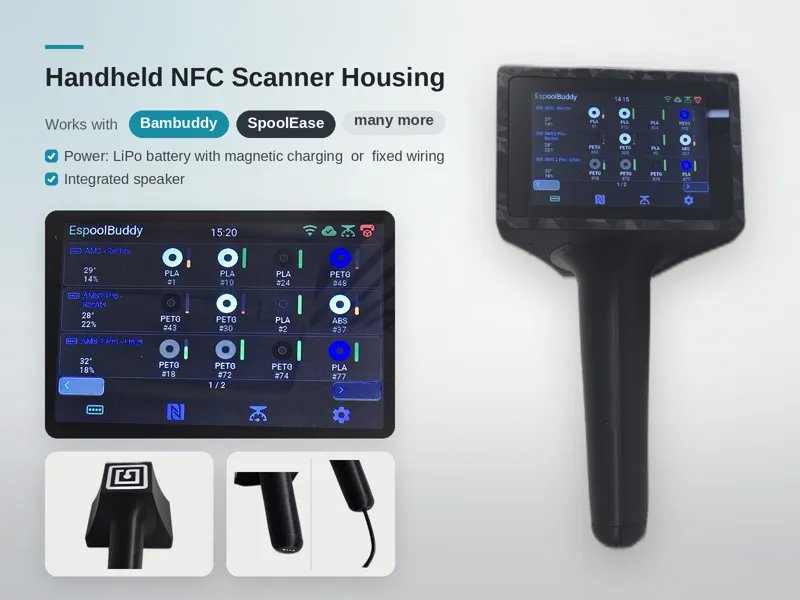
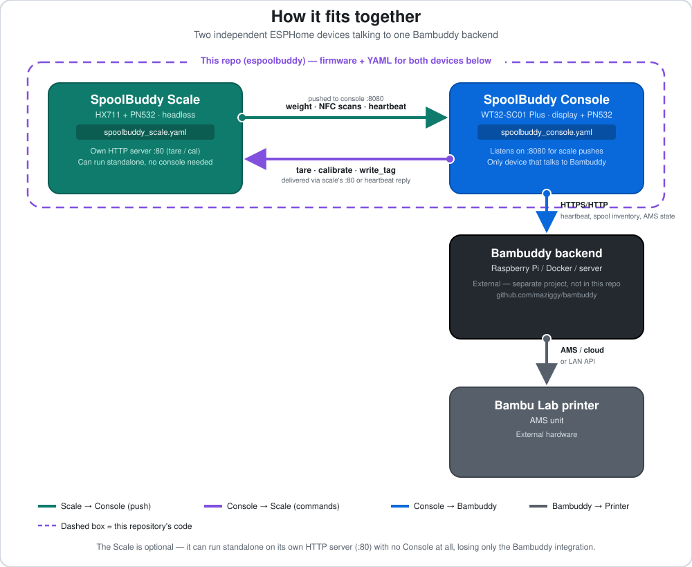
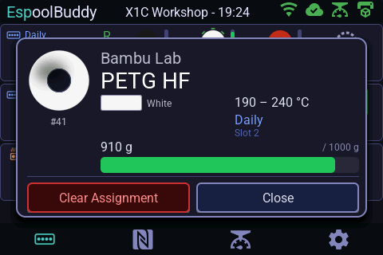
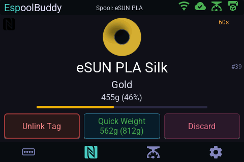
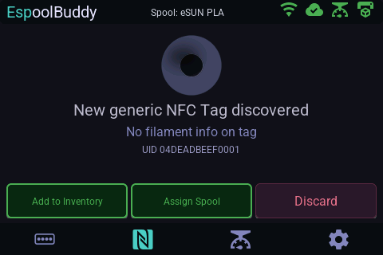
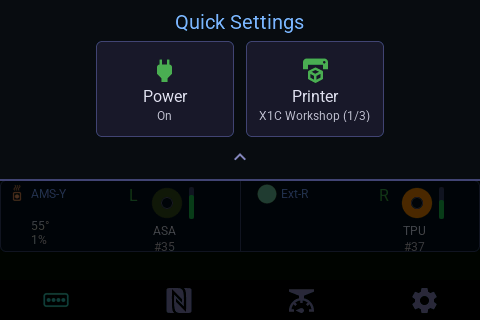

# ESPoolBuddy

**ESPoolBuddy** turns a couple of cheap ESP32-S3 boards into an NFC-tagged
filament spool tracker for [Bambuddy](https://github.com/maziggy/bambuddy) —
scan a spool's tag, load it into your AMS, and it's identified and assigned
automatically. No Raspberry Pi, no SD card, no Linux image to maintain —
just [ESPHome](https://esphome.io) firmware flashed straight onto the
boards.

   
  The console's AMS view: every loaded spool with its material, Bambuddy spool ID and remaining filament.
  <a href="#using-it-day-to-day">More screens below.</a>

It's a from-scratch reimplementation of Bambuddy's official
[SpoolBuddy](https://github.com/maziggy/bambuddy/tree/main/spoolbuddy)
client (which normally runs on a Raspberry Pi) — same idea, same backend
API, running natively on ESP32 instead. Not sure which one suits you? See the
**[ESPoolBuddy vs. SpoolBuddy comparison](docs/comparison.md)** for an honest
look at features and cost.

## What you can build

<table>
  <tr>
    <td align="center" width="33%">
       
      <b><a href="docs/console-wt32sc01.md">Console — WT32-SC01 Plus</a></b> 
      3.5″ touchscreen, NFC + speaker built in. Shown in the
      <a href="https://makerworld.com/en/models/3043887-nfc-handheld-case-bambuddy-spoolease-and-more#profileId-3423196">handheld case</a>.
    </td>
    <td align="center" width="33%">
       
      <b><a href="docs/console-pandatouch.md">Console — Panda Touch</a></b> 
      5″ touchscreen, external PN532 on I²C. Shown in the
      <a href="https://makerworld.com/en/models/3356046-pandatouch-nfc-cover#profileId-3815048">NFC cover</a>.
    </td>
    <td align="center" width="33%">
       
      <b><a href="docs/scale.md">Scale (optional)</a></b> 
      Load cell + NFC, pushes to the console. Shown in SpoolEase's
      <a href="https://makerworld.com/en/models/1323092-spoolease-scale-nfc-rfid-filament-weight-scale">scale case</a>
      (photo: SpoolEase, running its own firmware).
    </td>
  </tr>
</table>

---

## How it fits together

A full setup is two devices, and you only need the first one to get started:

- **Console** — a touchscreen that shows AMS/filament status, lets you scan,
  assign, and browse spools, and optionally shows live scale weight. It's
  the only device that talks to Bambuddy directly.
- **Scale** *(optional)* — a load cell + NFC reader that weighs a spool and
  pushes the reading straight to the console, which relays it to
  Bambuddy. It never talks to Bambuddy itself, so it just needs to know
  where the console is on your network.

Bambuddy and your Bambu Lab printer are separate, existing projects this
firmware talks to over the network — you'll need a
[Bambuddy](https://github.com/maziggy/bambuddy) instance running first.

---

## Pick your console

| | [WT32-SC01 Plus](docs/console-wt32sc01.md) ⭐ recommended | [Panda Touch](docs/console-pandatouch.md) |
|---|---|---|
| Screen | 3.5″, 480×320 | 5″, 800×480 |
| NFC built in | ✅ | ✅ via an external PN532 on I²C (or use the [Scale](docs/scale.md)) |
| Speaker built in | ✅ | ❌ |
| 3D-printed case | [Handheld case](https://makerworld.com/en/models/3043887-nfc-handheld-case-bambuddy-spoolease-and-more#profileId-3423196) or any SpoolEase console case | [PandaTouch NFC cover](https://makerworld.com/en/models/3356046-pandatouch-nfc-cover#profileId-3815048) — holds the PN532 beside the screen, magnetic dock still usable |
| Why pick it | Full feature set, smaller footprint | Bigger screen, one self-contained board, less to wire |

Both run the identical UI and firmware logic — only the hardware pinout
differs. Whichever you pick, you can add a [Scale](docs/scale.md) later for
automatic weighing — it brings its own NFC reader too.

---

## Get building

1. Get [Bambuddy](https://github.com/maziggy/bambuddy) running and grab an
   API key from its device settings.
2. Pick a console above and open its page for the parts list, wiring, and
   case options.
3. Follow the [setup & flashing guide](docs/setup.md) — install ESPHome, grab
   the one config file for your device, fill in your WiFi/Bambuddy details,
   and flash it. No clone needed; the config pulls everything else itself.
4. Optional: build a [Scale](docs/scale.md) too, for automatic spool
   weighing.

---

## Using it day to day

Scan a tag, load the spool, watch it get assigned in Bambuddy — most of it
just works without you thinking about it.

<table>
  <tr>
    <td align="center" width="50%">
       
      <b>AMS slot</b> — tap a slot for its spool's details
    </td>
    <td align="center" width="50%">
       
      <b>NFC</b> — scanned spool, ready to load into the AMS
    </td>
  </tr>
  <tr>
    <td align="center">
       
      <b>Unknown tag</b> — add it to the inventory or link an existing spool
    </td>
    <td align="center">
       
      <b>Quick settings</b> — swipe down for power plug and printer
    </td>
  </tr>
</table>

See
**[Using the device](docs/usage.md)** for the full walkthrough: auto-assign,
unlinked tags, weighing, writing tags, sleep behavior, and what the status
LEDs mean.

---

## More documentation

- **[ESPoolBuddy vs. SpoolBuddy](docs/comparison.md)** — how this compares
  to the official Raspberry Pi client, feature by feature and on cost
- **[Setup & flashing](docs/setup.md)** — install ESPHome, secrets, first
  flash, OTA updates
- **[Built-in load cell](docs/console-builtin-scale.md)** — optional,
  untested: wire an HX711 straight to the console instead of building a
  separate scale
- **[Configuration reference](docs/configuration.md)** — every tunable
  setting, what it does, and its default
- **[API reference](docs/api-reference.md)** — the Bambuddy endpoints this
  firmware calls, for anyone working on the backend side
- **[Troubleshooting](docs/troubleshooting.md)** — fixes for the most common
  hiccups
- **[Development / repo layout](docs/development.md)** — for anyone poking
  at the code

---

## Credits & related projects

This project stands on the shoulders of two other open-source projects:

- **[Bambuddy](https://github.com/maziggy/bambuddy)** by
  [maziggy](https://github.com/maziggy) — the backend server this firmware
  talks to. It manages your spool inventory, Bambu Lab printer/AMS polling,
  and the original Raspberry-Pi SpoolBuddy client that this firmware
  reimplements. **You need a running Bambuddy instance before an
  ESPoolBuddy device is useful** — see its repo for setup.
- **[SpoolEase](https://github.com/yanshay/SpoolEase)** by
  [yanshay](https://github.com/yanshay) ([spoolease.io](https://www.spoolease.io/))
  — the hardware design the WT32-SC01 Plus console is built around. The
  console/scale wiring and two-device concept are based on SpoolEase's
  excellent [hardware build guide](https://docs.spoolease.io/docs/build-setup/console-build)
  and case designs on [MakerWorld](https://makerworld.com/en/models/1138678-spoolease-console-nfc-rfid-filament-management).
  ESPoolBuddy reuses that hardware but is a from-scratch ESPHome firmware
  speaking the Bambuddy API — it's not SpoolEase's firmware and isn't
  affiliated with or supported by the SpoolEase project.

If you're already running Bambuddy, maybe already have SpoolEase hardware on
hand, and want a dedicated NFC console/scale for it, you're in the right
place.

---

## License & Disclaimer

**AGPL-3.0** (GNU Affero General Public License v3.0) — see [LICENSE](LICENSE).

This project is provided for informational and educational purposes only.
By using it, you accept the following:

- **Work at your own risk** — you're solely responsible for your safety and
  the proper handling of all electrical components.
- **No liability** — I'm not liable for any damages, injuries, or losses
  resulting from the use or misuse of the information and files provided.
- **No warranty** — this has been tested on my own workbench, but there's
  no guarantee it'll work flawlessly in your environment, given variations
  in component quality and assembly skill.

---

## Support this project

If ESPoolBuddy saved you a trip to the hardware store or an evening of
sorting spools, consider [starring the repo](https://github.com/CSchlipp/espoolbuddy) —
it helps others find it — or supporting ongoing development via
[Buy Me a Coffee](https://www.buymeacoffee.com/cschlipp) or
[Ko-fi](https://ko-fi.com/cschlipp). Any of these is appreciated, none is
expected.
