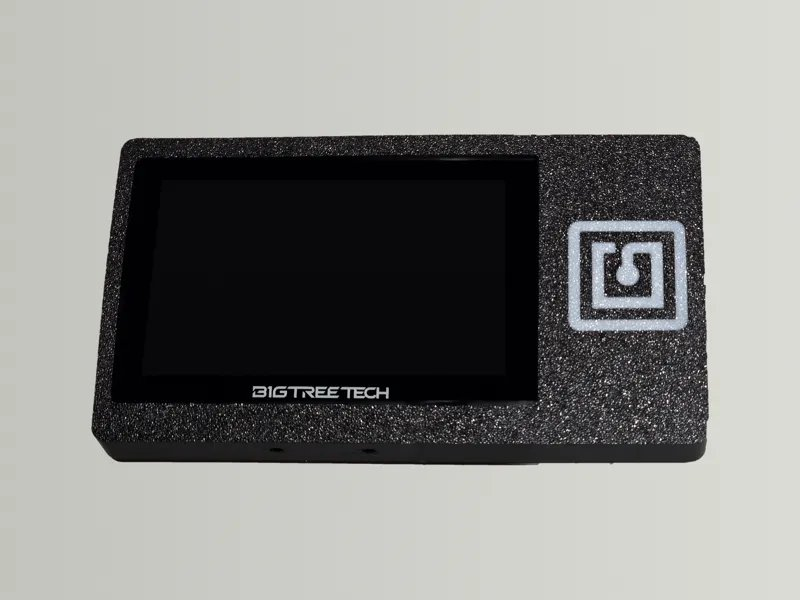
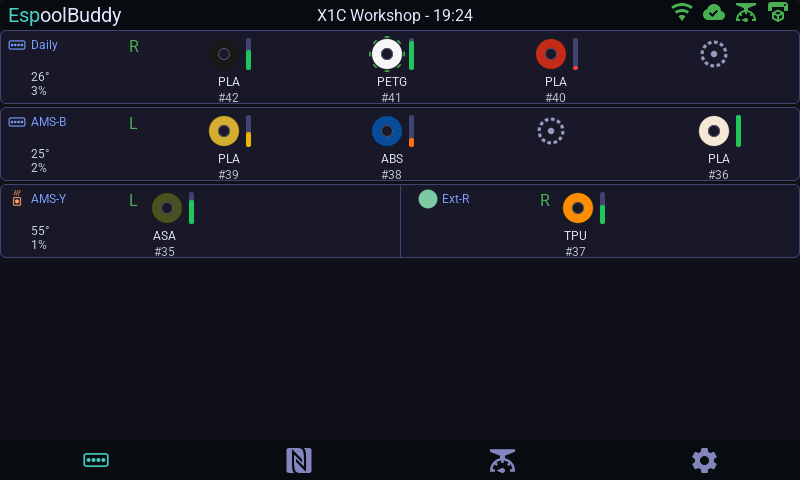
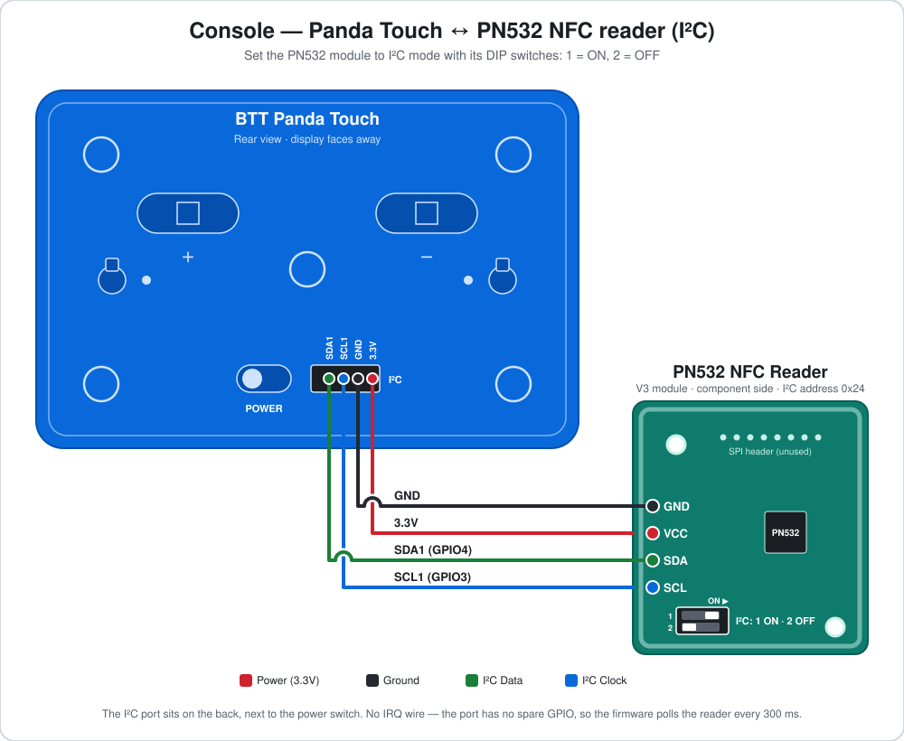

← [Back to README](../README.md)

# Console build: BigTreeTech Panda Touch

A second, ready-to-flash console build for the
**[BigTreeTech Panda Touch](https://github.com/bigtreetech/docs/blob/master/docs/PandaTouch.md)**
— a bigger 5″ screen on a single self-contained board.
Firmware: [`espoolbuddy_console_pandatouch.yaml`](../espoolbuddy_console_pandatouch.yaml).

*Panda Touch in the [PandaTouch NFC Cover](https://makerworld.com/en/models/3356046-pandatouch-nfc-cover#profileId-3815048) (MakerWorld), with the PN532 behind the NFC logo.*

It runs the exact same UI as the [WT32-SC01 Plus console](console-wt32sc01.md)
(the layout adapts to the screen size automatically). NFC works through an
external PN532 on the I²C port on the back of the device; only the speaker is
missing, since the board doesn't have one.

 

*The AMS tab at the Panda Touch's 800×480. See
[Using the device](usage.md) for the other screens.*

## Bill of materials

| Part | Notes |
|---|---|
| [BigTreeTech Panda Touch](https://github.com/bigtreetech/docs/blob/master/docs/PandaTouch.md) | ESP32-S3, 800×480 touchscreen, 8 MB PSRAM, 16 MB flash. Display, touch and backlight are all onboard. |
| PN532 NFC module | **I²C mode** — DIP switch **1 = ON, 2 = OFF** |
| 4-wire cable with JST-PH 2.0 connector | To connect the PN532 to the I²C port on the back — keep it short, ~15cm |
| [PandaTouch NFC Cover](https://makerworld.com/en/models/3356046-pandatouch-nfc-cover#profileId-3815048) | (Optional) 3D-printed frame that holds the PN532 next to the screen — see [below](#3d-printed-cover) |
| USB-C cable | For the first (wired) flash and power |

The PN532 is optional: without it the console boots and works normally, it
just reports NFC as not OK to Bambuddy. To drop NFC entirely, remove the
`bambuddy_nfc:` block and the `nfc_i2c` bus from the YAML.

## Wiring the NFC reader

The PN532 connects to the 4-pin **I²C** port on the back of the device, next
to the power switch. Its pins are printed on the case, left to right:
`SDA1 · SCL1 · GND · 3.3V`. The port carries the board's second I²C bus
(I2C1, header P2 in BTT's pinout). The touch controller has its own bus
(I2C0), so the two never share wires.

Before wiring, set the PN532's mode DIP switches to I²C: **switch 1 ON,
switch 2 OFF**. On the common red V3 module the 2-way switch sits right
next to the SCL end of the 4-pin header, and the table printed beside it
shows the same setting (`I2C 1 0`).

The PN532's pins, top to bottom, are GND, VCC, SDA, SCL. That is a
different order from the port, so the wires cross over:

| PN532 pin | Panda Touch I²C port | Notes |
|---|---|---|
| GND | GND | |
| VCC | 3.3V | |
| SDA | SDA1 | I²C data (GPIO4) |
| SCL | SCL1 | I²C clock (GPIO3) |

As there is no IRQ line, the firmware polls the reader every `poll_interval`
(300 ms by default). Detection reacts slightly slower than on the
WT32-SC01 Plus, but everything else is identical: Bambu tag decoding
(material, colour, temperatures, tray UID), NTAG writes and NDEF detection.
Within a single tag read the reader is polled every millisecond, which keeps
the multi-step Bambu read — the time the spool has to stay still — short.

The bus runs at 100 kHz, which is plenty for the PN532 and forgiving of
cable length. The reader's I²C address is `0x24` (the PN532 default).

Panda Touch pin map (reference only)

| Function | GPIO |
|---|---|
| Touch (GT911) SDA / SCL / INT / RST — I2C0, onboard | GPIO2 / GPIO1 / GPIO40 / GPIO41 |
| Rear I²C port (P2) SDA1 / SCL1 — I2C1, PN532 | GPIO4 / GPIO3 |
| Backlight (PWM) | GPIO21 |
| Display reset | GPIO46 |

Source: [PandaTouch_IDF pinout](https://github.com/bigtreetech/PandaTouch_IDF/blob/master/docs/pinout.md).

## 3D-printed cover

The [PandaTouch NFC Cover](https://makerworld.com/en/models/3356046-pandatouch-nfc-cover#profileId-3815048)
on MakerWorld mounts the PN532 in a frame beside the screen, behind an NFC
logo that marks where to hold a spool's tag. It clamps onto the sides of the
Panda Touch and leaves the back untouched, so the magnetic charging dock
still works. The cable runs from the rear I²C port through a clip channel
in the frame to the reader.

Besides the printed parts you'll need heat-set inserts (M2 for the PN532
standoffs, M3 for the cover bosses), M3 nuts and set screws for the side
clamping pads, and M3×8 countersunk screws for the cover. The listing has
the full assembly steps. Mount the PN532 with its flat side facing forward,
and set its DIP switches to I²C before closing the cover.

## Known limitations

- **No speaker.** The tag-scan/weight-stable chimes are silently skipped —
  the Settings screen hides the Sound toggle automatically since there's no
  speaker to control, and the quick-settings drawer drops its Sound tile for
  the same reason.
- **No NFC IRQ.** The PN532 runs in polling mode (see
  [above](#wiring-the-nfc-reader)); tag detection is slightly slower than on
  the WT32-SC01 Plus.
- **Occasional display glitches.** This build has shown intermittent visual
  artifacts on real hardware. It's believed to be related to how this
  board's RGB-parallel display works, rather than a firmware bug — the
  WT32-SC01 Plus console doesn't have this issue. Not yet fully solved.

## Setup & flashing

Wire the PN532 as above (or skip it), then follow the
[setup & flashing guide](setup.md), using
`espoolbuddy_console_pandatouch.yaml` wherever it says `<console file>`.
