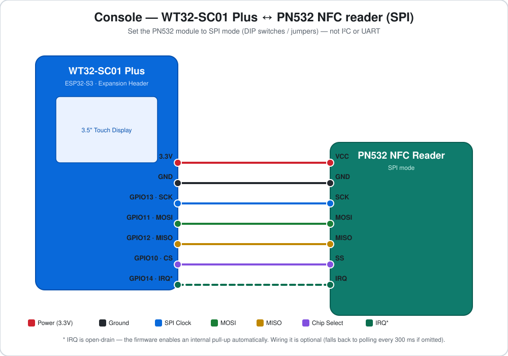
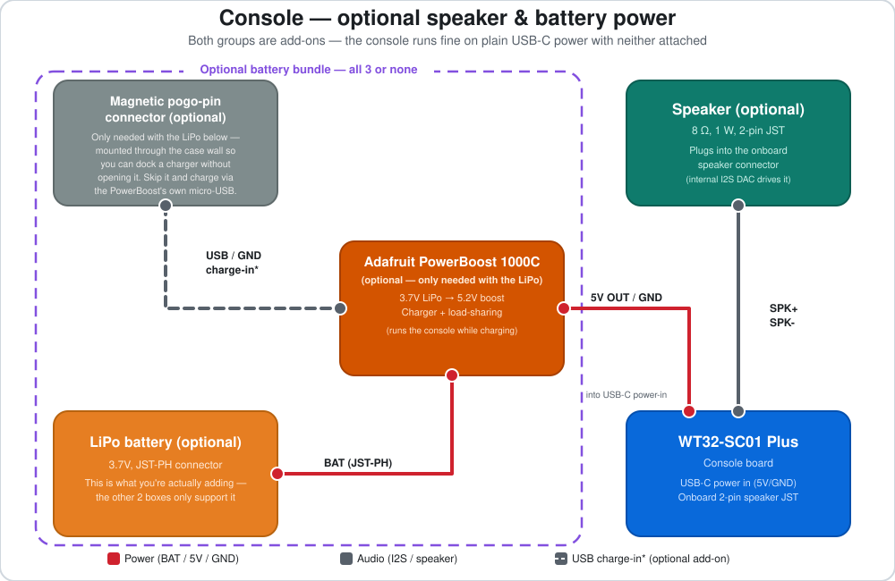

← [Back to README](../README.md)

# Console build: WT32-SC01 Plus

This is the **recommended** console build — a 3.5″ touchscreen with NFC and a
speaker built in. Firmware: [`espoolbuddy_console.yaml`](../espoolbuddy_console.yaml).

Prefer a bigger screen and fewer parts to source instead? See the
[Panda Touch console](console-pandatouch.md) build.

## Bill of materials

| Part | Notes |
|---|---|
| [WT32-SC01 Plus](https://www.wireless-tag.com/portfolio/wt32-sc01-plus/) | ESP32-S3, 3.5″ 480×320 touchscreen, onboard I2S speaker amp |
| PN532 NFC module | **SPI mode** — set the module's DIP switches/jumpers to SPI, not I²C/UART |
| USB-C cable | For the first (wired) flash and power. If used with the battery, angled connectors like [this](https://de.aliexpress.com/item/1005007470552376.html) are recommended |
| 7-wire cable | To connect the PN532 to the expansion header |
| [Speaker](https://de.aliexpress.com/item/1005005699690954.html) | (Optional) Adds fancy beeps when something happens. Basically any speaker should work, just notice the JST 1.25 connector. |
| 18650 LiPo Battery | (Optional) For mobile/battery-powered use. Confirm the polarity of the battery connector matches the requirements of the Adafruit PowerBoost board! |
| [Adafruit PowerBoost 1000C](https://www.adafruit.com/product/2465) | (Optional) Only needed if you add the LiPo battery — boosts/charges it |
| [Magnetic charging connector](https://de.aliexpress.com/item/1005007988032729.html) | (Optional) Also only needed with the LiPo — lets you charge it without opening the case. Pick one with a **fixed polarity**, so it can only be attached one way! |

## Wiring

> The wiring below uses **IRQ mode** for the PN532 (interrupt-driven — the
> firmware reacts to a tag instantly instead of polling). If you skip the
> IRQ wire, the firmware falls back to polling every `poll_interval` ms —
> still works, just slightly slower to react.

| PN532 pin | WT32-SC01 Plus GPIO | Notes |
|---|---|---|
| VCC | 3.3 V | |
| GND | GND | |
| SCK | GPIO13 | SPI clock |
| MOSI | GPIO11 | Controller-out / Peripheral-in |
| MISO | GPIO12 | Controller-in / Peripheral-out |
| SS (CS) | GPIO10 | Chip select |
| IRQ | GPIO14 | Open-drain; firmware enables an internal pull-up |

The display, touch controller and backlight are already wired internally on
the WT32-SC01 Plus board — nothing to connect for those.

Internal WT32-SC01 Plus pin map (reference only, already wired on-board)

| Function | GPIO |
|---|---|
| Display WR/clock (8080 parallel) | GPIO47 |
| Display data bus D0–D7 | GPIO9, 46, 3, 8, 18, 17, 16, 15 |
| Display reset | GPIO4 |
| Touch (FT6336U) SDA / SCL / INT | GPIO6 / GPIO5 / GPIO7 (I²C addr `0x38`) |
| Backlight (PWM) | GPIO45 |
| Speaker I2S LRCLK / BCLK / DOUT | GPIO35 / GPIO36 / GPIO37 |

### Optional: speaker & battery power

- **Speaker** — the WT32-SC01 Plus has a 2-pin JST speaker connector wired
  internally to its I2S DAC/class-D amp — nothing to configure. Plug in any
  8 Ω, ~1 W speaker and the firmware's chimes (tag-scan / weight-stable)
  play automatically; leave it unplugged and the console works identically,
  just silently.
- **Battery power** — entirely optional; the console runs fine on permanent
  USB-C power with no battery at all. If you want cordless use:
  1. Wire a single-cell 3.7 V LiPo (JST-PH connector) to the PowerBoost
     1000C's `BAT` input. Watch the polarity!
  2. Connect the PowerBoost's USB-A output to the WT32-SC01 Plus's USB-C
     power input. Its load-sharing charger runs the console *and* charges
     the battery at the same time whenever USB power is present.
  3. Wire the PowerBoost's 5V/GND pins to a **magnetic pogo-pin connector**
     mounted at the bottom of the case, so you can dock a charger to top up
     the battery without opening the enclosure. Watch the polarity here too
     — make sure the cable can't be connected backwards!

## 3D printed case

This firmware doesn't require any particular case — it works with **any
existing SpoolEase case model**, since the hardware (WT32-SC01 Plus + PN532)
and mounting are the same:

- **Regular case** (no battery/speaker): SpoolEase's own
  [console case](https://makerworld.com/en/models/1138678-spoolease-console-nfc-rfid-filament-management)
  on MakerWorld.
- **Handheld case with optional battery/speaker**: if you're adding the
  battery bundle above, [my own case](https://makerworld.com/en/models/3043887-nfc-handheld-case-bambuddy-spoolease-and-more#profileId-3423196)
  has a battery compartment and a cutout for the magnetic pogo-pin connector
  that the stock SpoolEase case doesn't. The battery bundle is optional here
  too — this case also works wired directly to USB-C, no battery/PowerBoost
  at all, same as any SpoolEase case.

## Setup & flashing

Once it's wired up, head to the [setup & flashing guide](setup.md) — use
`espoolbuddy_console.yaml` wherever it says `<console file>`.
