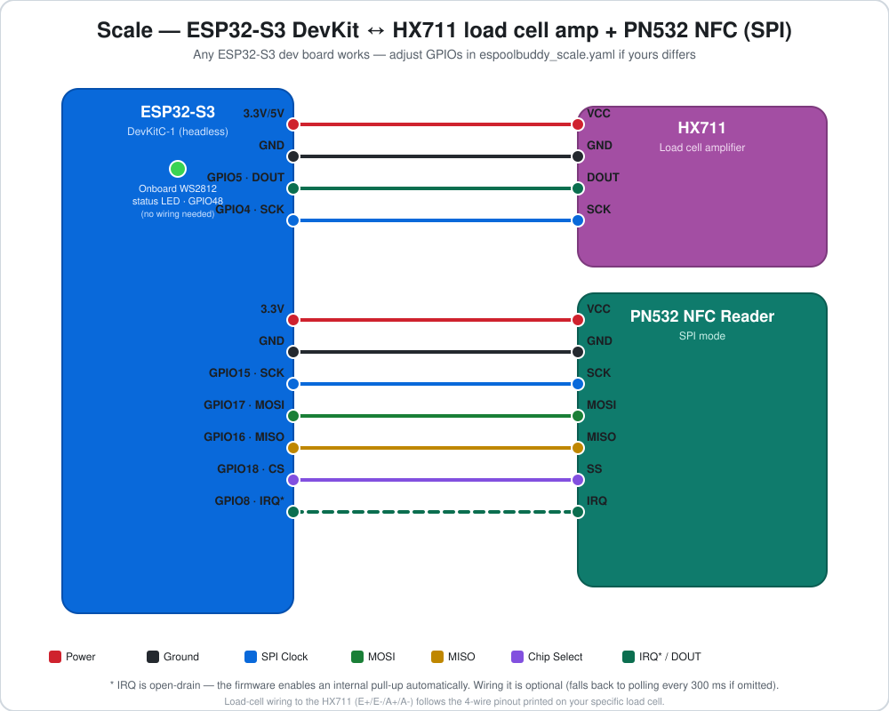

← [Back to README](../README.md)

# Scale build (optional)

A load cell + NFC reader that weighs a spool and pushes the reading straight
to the console — no display of its own, no direct connection to Bambuddy.
Firmware: [`espoolbuddy_scale.yaml`](../espoolbuddy_scale.yaml).

Works with either console build. It's what the console uses by default
(`scale: type: remote`). A console can instead read a
[load cell wired to itself](console-builtin-scale.md) (optional, untested).

Just want a scale in Home Assistant, without a console? Then you don't need
`bambuddy_api` at all: delete its block and the `bambuddy_nfc` block, and the
HX711 sensor still shows up in Home Assistant.

## Bill of materials

| Part | Notes |
|---|---|
| ESP32-S3 dev board | e.g. **ESP32-S3-DevKitC-1** (used by this project — has an onboard WS2812 status LED on GPIO48). Any ESP32-S3 board works; adjust pins if different. |
| HX711 load cell amplifier | 24-bit ADC breakout |
| Load cell | Any straight-bar load cell that fits your scale base (0.5–5 kg range is plenty for a filament spool) |
| PN532 NFC module | Same as the WT32-SC01 Plus console, SPI mode |
| USB-C cable | For the first (wired) flash |

## Wiring



| Peripheral pin | ESP32-S3 GPIO | Notes |
|---|---|---|
| HX711 DOUT | GPIO5 | Data |
| HX711 SCK | GPIO4 | Clock |
| HX711 VCC / GND | 3.3 V or 5 V / GND | Check your HX711 module's rated voltage |
| PN532 SCK | GPIO15 | SPI clock |
| PN532 MOSI | GPIO17 | Controller-out / Peripheral-in |
| PN532 MISO | GPIO16 | Controller-in / Peripheral-out |
| PN532 SS (CS) | GPIO18 | Chip select |
| PN532 IRQ | GPIO8 | Open-drain; firmware enables an internal pull-up |
| PN532 VCC / GND | 3.3 V / GND | |
| Status LED (WS2812) | GPIO48 | Already onboard on most DevKitC-1 boards; red = no WiFi, blue = WiFi but console unreachable, green = connected |

Load-cell wiring to the HX711 (E+/E-/A+/A-) follows the standard 4-wire
half-bridge pinout printed on your specific load cell — not
project-specific, check its datasheet.

> Using a different ESP32-S3 board without an onboard WS2812? Either wire an
> external one to GPIO48, or delete the `light:` block in
> `espoolbuddy_scale.yaml` — it's cosmetic only.

## 3D printed case

Any existing SpoolEase [scale case](https://makerworld.com/en/models/1323092-spoolease-scale-nfc-rfid-filament-weight-scale)
on MakerWorld fits — the hardware and mounting are the same.

[](https://makerworld.com/en/models/1323092-spoolease-scale-nfc-rfid-filament-weight-scale)

*[SpoolEase Scale case](https://makerworld.com/en/models/1323092-spoolease-scale-nfc-rfid-filament-weight-scale) (photo: SpoolEase, running its own firmware).*

## Setup & flashing

Wire it up, then follow the [setup & flashing guide](setup.md) using
`espoolbuddy_scale.yaml` wherever it says `<console file>`.

## Point it at the console

The scale pushes readings to `console_url`, which defaults to
`http://espoolbuddy-console.local` in `espoolbuddy_scale.yaml`. This relies on
mDNS resolving the console's hostname on your LAN, which works out of the
box on most home networks. If that doesn't work, or you renamed the console,
use its static IP instead, e.g. `http://192.168.1.50`.

**Pushing to more than one console?** `console_url` also accepts a list:

```yaml
console_url:
  - "http://espoolbuddy-console.local"
  - "http://espoolbuddy-console-2.local"
```

The **first** console in the list is authoritative — only its heartbeat
response is used for `tare`/`calibrate`/`write_tag` commands, and only its
reachability drives the scale's status LED. Any additional consoles just
receive every weight/NFC event as read-only observers; they can't send
commands back. This keeps two consoles from racing each other to trigger a
tare or calibration.

## Calibrate the scale

Calibration is a **built-in console workflow** — nothing to trigger from the
Bambuddy dashboard:

1. On the console, open the **Scale** tab and tap **TARE** with nothing on
   the scale, to zero it.
2. Place a known reference weight on the scale (e.g. a 500 g calibration
   weight, or a spool you've already weighed on a kitchen scale).
3. Tap **CALIBRATE**. A modal opens with a reference-weight field and
   ±1/10/100 g stepper buttons — dial it in to match the weight you placed,
   then confirm.

The console sends the tare/calibrate command to the scale on its next
heartbeat (within ~1 s); the scale stores the resulting slope/offset itself,
so it survives reboots. If the scale is offline, or its HX711 stops
delivering readings, the console shows **No scale connected** and sends
nothing. A command the scale couldn't pick up within 15 s is dropped rather
than applied later. The **Tare Scale** button the scale exposes to Home
Assistant tares it directly.

## How the firmware reads the load cell

The `scale:` block in `espoolbuddy_scale.yaml` hands the HX711 sensor to
`bambuddy_api`:

```yaml
bambuddy_api:
  console_url: "http://espoolbuddy-console.local"
  scale:
    type: local
    sensor: spool_weight
```

`bambuddy_api` applies tare and calibration, decides when the reading has
settled (no move of `stable_band` or more for `stable_after`) and reports a
dead or unplugged HX711 to the console. All options are in the
[configuration reference](configuration.md#weight-source-scale).

## Migrating from 2.x

Firmware 3.0.0 removed `scale_mode`. The device's role now follows from its
config: `console_url` means it pushes to a console, and `scale:` says where its
weight comes from. An old scale YAML fails to compile with a message pointing
here. To migrate your own copy of `espoolbuddy_scale.yaml`:

1. In `bambuddy_api:`, delete `scale_mode: true` and add:
   ```yaml
     scale:
       type: local
       sensor: spool_weight
   ```
2. Delete the stability `globals:` (`scale_last_change_ms`, `scale_last_grams`,
   `scale_is_stable`), the HX711 sensor's `on_value:` lambda, and the
   `250ms` `interval:` that called `on_scale_reading()`. Keep the sensor's
   filters as they are.
3. Delete `- lambda: bambuddy->restart_scale_server();` from `wifi:` →
   `on_connect:`. The scale no longer runs its own HTTP server on port 80
   (`/weight`, `/tare`, `/calibrate`); tare and calibrate reach it through the
   console.

The tare and calibration stored on the scale are kept: same NVS keys.
